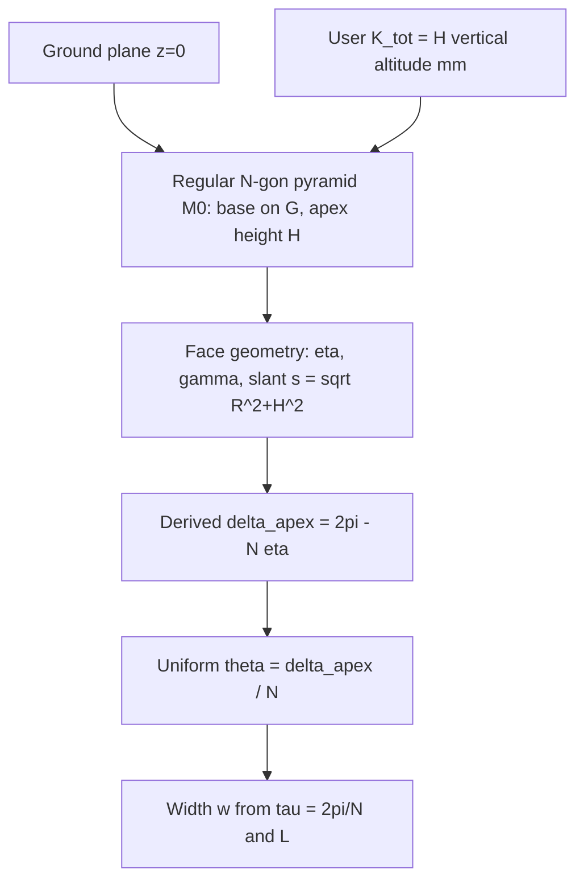
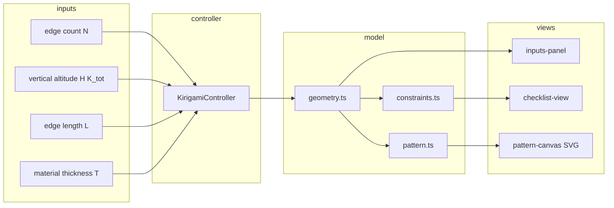

# AKDE — Kirigami uniform-molecule planner (project restart)

**Status:** Implemented (TypeScript/Vite app under `kirigami/` + `app/`)  
**Authority:** Liu, Chuang, Sang, Sabin, DETC2019-97557 (edge-molecule inverse process)  
**Last updated:** 2026-05-20

### Changes — 2026-05-21

- **Valid κ range clarified (§2.6.3).** Any finite κ = H/R > 0 is geometrically valid, including κ > 1 (ψ > 45°): a taller apex lengthens the slant edge `s = √(R²+H²)` (always > H, so the apex is always reachable) and narrows the faces (η → 0). No upper H bound except the degenerate κ → ∞ limit; C1–C6 verified passing up to κ = 50.
- **Corrected degenerate-apex limit.** The §2.6.3 warning said `η → π`; the real tall-pyramid degenerate limit is **`η → 0`** (sliver faces as κ → ∞).
- **C5 trip point corrected (§10).** C5 (`w ≤ L`) first fails near κ ≈ 1.45 (N=3) to ≈1.75 (N=12), not the κ ≈ 1.3 stated earlier — κ = 1 is just ψ = 45°, not a fold-overlap boundary.

### Changes — 2026-05-20

- **Default template is now N = 6** (hexagonal pyramid), L = 100 mm, H = R = 100 mm (ψ = 45°, κ = 1). N = 4 stays as the canonical worked example below.
- **New input `outerEdgeLength` (L₀)** — sets each polygon face's outer perimeter edge length independently of L; molecule chords absorb the remainder so the outer 2N-gon stays closed (default L₀ = L reproduces the standard net). See §3.1.
- **Edge-molecule end leg `D(i,j) = 2·s·tan(θ/2) = w/cos(θ/2)`** derived from DETC Figure 2 (`computeMoleculeEndLeg`); exposed as derived `moleculeEndLeg`. See §2.6.5.
- **Minor cut reworked.** The active formula is **`fold-reach`**: `ℓ = hypot(w/2, r_apex)` — it reaches the valley crease (w/2 leg) while the penetration depth = major-cut radius `r_apex`, so minor and major cuts shrink together as apex height grows. Selectable family in `MINOR_CUT_FORMULA` (`tuck-flap`, `lie-flat`, `fold-bound`, `strip-removal`, `end-leg`, `fold-clearance`, `fold-reach`). Exposed as derived `minorCutLength`. See §2.6.5, §6.
- **Constraints C5 and C6 are now evaluated** (AKDE proxies; see §2.5, §10).

---

## 1. Problem statement and scope

### 1.1 Goal

Build a small web tool that maps user inputs to a **valid 2D kirigami net** with **uniform** edge-molecule parameters:

| Input | Meaning | Units |
|-------|---------|-------|
| **Edge count** \(N\) | Number of boundary edges in the chosen template (each edge carries one edge molecule) | dimensionless |
| **Total curvature** \(K_{\mathrm{tot}}\) | **Pyramid altitude** \(H\): **vertical** distance from the **base/ground plane** to the **apex** (perpendicular to the base), after construction. **Not** slant edge \(s\), **not** distance along a lateral face, **not** \(\sqrt{R^2+H^2}\). **Not** \(\sum\theta\), **not** \(N\theta\), **not** an angle-defect budget (see §2.6). Derived: \(s=\sqrt{R^2+H^2}\), \(\psi=\arctan(H/R)\), \(\kappa=H/R\) (read-only) | **mm** |
| **Edge length** \(L\) | Base edge length of the regular \(N\)-gon pyramid net | **mm** |
| **Outer edge length** \(L_o\) | Outer-perimeter edge length of each polygon face (sets the outer-base angular span; molecule chords absorb the remainder). Optional; default \(L_o = L\) reproduces the standard net (§3.1) | **mm** |
| **Material thickness** \(T\) | Sheet thickness used to size the major-cut hole at the closure vertex: \(r_{\mathrm{apex}} = T/\sin(\theta/2)\) (see §2.6.4) | **mm** |

| Output | Meaning | Units |
|--------|---------|-------|
| **\(\theta\)** | Common edge-molecule angle (all molecules equal) | rad (internal); UI may show ° |
| **\(w\)** | Common edge-molecule width (all molecules equal) | **mm** |
| **\(R\), \(s\)** (derived display) | Base circumradius; slant edge apex→base vertex \(s=\sqrt{R^2+H^2}\) (\(H\) is user input as \(K_{\mathrm{tot}}\), not repeated here) | **mm** (read-only) |
| **\(D = 2s\tan(\theta/2)\)** | Edge-molecule end leg (DETC Fig 2 `D(i,j)`); derived `moleculeEndLeg` | **mm** (read-only) |
| **Minor cut \(\ell\)** | Active fold-reach minor-cut length \(\mathrm{hypot}(w/2,\,r_{\mathrm{apex}})\); derived `minorCutLength` | **mm** (read-only) |
| **2D pattern** | Polygon net + molecule outlines, cuts, folds | coordinates in **mm** |

### 1.1.1 Units convention (v1)

| Category | Rule |
|----------|------|
| **Physical lengths** | All length inputs and length readouts use **millimeters (mm)** only: \(K_{\mathrm{tot}} = H\) (**vertical** altitude), \(L\), \(w\), \(R\), derived \(s\), and pattern/SVG coordinates. |
| **Angles** | \(\theta\), \(\eta\), \(\psi\), \(\delta\), \(\beta\), \(\tau\), \(\gamma\) are computed in **radians** internally; the UI may display **degrees** for angles only. |
| **Dimensionless** | \(N\), \(\kappa = H/R\), and constraint residuals are unchanged (no length unit). |
| **No conversion in v1** | The app does **not** convert from cm, m, or inches. The user must enter **mm**. |
| **Glossary (lengths)** | **\(H\)** — altitude (mm): vertical apex height above the base plane. **\(s\)** — slant edge (mm): \(\sqrt{R^2+H^2}\) from apex to a base vertex along a lateral face; used in the \(\eta\) formula denominator, **not** \(H\). |
| **Default inputs (current)** | **\(N = 6\)**, **\(L = 100\ \mathrm{mm}\)**, **\(L_o = 100\ \mathrm{mm}\)**, **\(K_{\mathrm{tot}} = H = R = 100\ \mathrm{mm}\)** (\(\psi = 45°\), \(\kappa = 1\)), **\(T = 1\ \mathrm{mm}\)**. The square pyramid (\(N=4\), \(H\approx 70.7\)) remains the canonical worked example in §9. |

Scale invariance: for fixed \(N\) and ratio \(H/L\), all angles and \(\kappa\) are unchanged if every length is multiplied by the same factor; hand-check tables may use **\(L = 1\ \mathrm{mm}\)** with a note when only dimensionless quantities are compared (§9).

### 1.2 In scope (v1)

- **Theory:** DETC Eqs. (1)–(4) with **uniform** \(\theta\), \(w\) on all molecules
- **Default 3D template:** Regular **\(N\)-gon pyramid** net (one apex, \(N\) lateral edge molecules) — see §3
- **MVC layout** at repo root (no `src/`): `kirigami/{model,view,controller}`, `app/`
- **UI:** inputs panel, live constraint checklist, SVG pattern view with fixed line-style legend (§5–6)
- **Tests:** Hand-checkable numeric cases (§9)

### 1.3 Out of scope (explicitly dropped from prior directions)

- Blockly / visual programming
- 30-step CBP roadmaps or Tan & Wang **implementation** phases
- Forward-process FEA, Kangaroo, ANSYS (DETC §3.2, Eqs. (5)–(6))
- Doubly curved Enneper flattening (DETC Figure 5)
- DNA / auxetic / heat–light demos (DETC §4)
- Non-uniform per-edge \(\theta(i,j)\), \(w(i,j)\) (paper’s general case; future v2)
- Auto-commit / CI / packaging (until requested)

### 1.4 Papers

| Role | Reference |
|------|-----------|
| **Primary** | DETC2019-97557 — see [references.md](references.md) |
| **Background** | Liu et al. 2018 (L18); Tan & Wang (polyhedral kirigami context only) |

---

## 2. Theory from DETC (uniform molecule reduction)

### 2.1 Edge molecule (DETC Figure 2)

Between adjacent polygons of goal mesh \(M_0\), the inverse map inserts a **quadrilateral symmetric trapezoid** edge molecule with:

- **\(\theta(i,j)\)** — angle between the two edges of the molecule  
- **\(w(i,j)\)** — molecule width (hinge / tuck scale)  
- **Valley crease** — midpoint of the non-equal edge  
- **Major cut** — at shared vertices (remove folded-in area)  
- **Minor cut** — from dihedral angle between adjacent faces and hinge width (avoid tucked-fold intersection)

**Uniform assumption (AKDE v1):**  
\(\theta(i,j) \equiv \theta\) and \(w(i,j) \equiv w\) for every edge molecule in the template.

### 2.2 Angle closure — Eq. (1)

At vertex \(i\) of the 2D pattern, with \(n_i\) incident molecules in cyclic order \(j_n\):

\[
2\pi = \sum_{n=0}^{n_i-1} \theta(i,j_n) + \sum_{n=0}^{n_i-1} \beta(i,j_n)
\]

\(\beta(i,j)\) are **goal-mesh** face angles at that vertex (fixed by the chosen polyhedron template).

**Uniform reduction** at a vertex with \(n_i = N\) and identical \(\beta\):

\[
\boxed{\; N\,\theta + N\,\beta = 2\pi \;\Rightarrow\; \theta = \frac{2\pi}{N} - \beta \;}
\]

**Angle defect link (DETC, at a closure vertex):** \(\delta_i = 2\pi - \sum \beta = N\theta\) when all angular slack is in molecules. So

\[
\boxed{\;\theta = \delta_i / N\;}
\]

This is a **consequence** of Eq. (1) and the chosen goal mesh \(M_0\), not a definition of user \(K_{\mathrm{tot}}\).

For the **default pyramid**, discrete Gauss curvature is concentrated at the **3D apex** once the shape is erected: \(\delta_{\mathrm{apex}} = 2\pi - N\,\eta\), where \(\eta\) is the **face angle at the pyramid apex** in \(M_0\) (fixed by ground-referenced geometry in §2.6). Then

\[
\boxed{\;\theta = \delta_{\mathrm{apex}} / N = \bigl(2\pi - N\,\eta\bigr)/N\;}
\]

**Do not** use \(\theta = K_{\mathrm{tot}}/N\) unless \(K_{\mathrm{tot}}\) has been **derived** to equal \(\delta_{\mathrm{apex}}\) under the confirmed v1 proxy (generally false).

Base vertices of the flat net are Euclidean (\(\delta = 0\)); there \(\theta = 2\pi/N - \beta_{\mathrm{base}}\) must be consistent with template geometry (§3.2). **v1:** lateral-only net has no molecules on base edges — C8 not in UI.

### 2.3 Positional closure — Eq. (2)

\[
\sum_{n=0}^{N-1} w \begin{bmatrix}
\cos\Phi_n \\
\sin\Phi_n
\end{bmatrix}
=
\begin{bmatrix} 0 \\ 0 \end{bmatrix}
\]

with (DETC indexing, half-angle accumulation at vertex \(i\)):

\[
\Phi_n = \sum_{m=1}^{n} \left( \tfrac{1}{2}\bigl(\theta(i,j_{m-1}) + \theta(i,j_m)\bigr) + \beta(i,j_m) \right)
\]

**Uniform reduction** with constant \(\theta\), \(\beta\) and step \(\tau = \theta + \beta\):

\[
\Phi_n = n\,\tau \quad (\text{with appropriate } j_0 \text{ phase; symmetric template uses } \tau = 2\pi/N)
\]

Eq. (1) gives \(N\tau = 2\pi\). Then Eq. (2) is a **regular \(N\)-gon** of length-\(w\) vectors in the plane: closure holds for any \(w > 0\) when phases are equally spaced (centroid at origin). **Magnitude** of \(w\) is fixed by **slant length** \(s\) and the molecule wedge angle \(\theta\) at the apex closure vertex (Figure 2), not by Eq. (2) alone.

**Practical width formula (v1, mm) — Figure 2 apex-centered fan:**  
\(w\) is the **outer chord** of the molecule wedge at slant radius \(s\) — the chord on the outer perimeter between adjacent triangle base vertices:

\[
\boxed{\; w = 2\,s\,\sin(\theta/2) \;}, \qquad s = \sqrt{R^2 + H^2}
\]

The outer perimeter is then a 2\(N\)-gon inscribed in a circle of radius \(s\), with edges alternating triangle base \(L = 2s\sin(\eta/2)\) and molecule chord \(w = 2s\sin(\theta/2)\).

Implementation should **verify** Eq. (2) numerically to tolerance \(\varepsilon\) and treat mismatch as constraint failure (iterative solve path mirrors DETC when a non-symmetric template is added later).

### 2.4 Inequalities — Eqs. (3)–(4)

| ID | DETC | Uniform form | Checklist label |
|----|------|--------------|-----------------|
| **C3** | \(-\pi < \theta(i,j) < \pi\) | \(-\pi < \theta < \pi\) | Molecule angle in range |
| **C4** | \(w_{i,j} \ge 0\) | \(w \ge 0\) | Non-negative width |

### 2.5 Additional validity (DETC text + Figure 2)

| ID | Source | Statement |
|----|--------|-----------|
| **C5** | AKDE (fold overlap) | Molecule must tuck without protruding past its faces: \(w \le L\). No closed form in DETC; AKDE proxy. |
| **C6** | AKDE (cut vs dihedral) | Dihedral-driven relief depth fits the molecule slant: \(T\tan(\gamma/2) \le s - r_{\mathrm{apex}}\). AKDE proxy. |
| *(cuts)* | Figure 2 / §6 | Major/minor cuts also drawn in the pattern SVG (gray solid) per §6. |

**In v1 UI (evaluated):** **C5** (fold overlap, \(w \le L\)) and **C6** (cut vs dihedral, \(T\tan(\gamma/2) \le s - r_{\mathrm{apex}}\)) are AKDE geometric-validity checks — the DETC paper names them but gives no closed form, so the conditions above are AKDE interpretations (modeling thresholds, tunable). **Still not evaluated:** **C8** (base-vertex consistency — lateral-only topology).

**Moved to input validation (not checklist):** \(H = K_{\mathrm{tot}} > 0\) — UI shows an error under the apex-height field and skips geometry/pattern recompute when \(H \le 0\).

### 2.6 Total curvature \(K_{\mathrm{tot}}\) — ground-referenced pyramid shape

#### 2.6.1 What \(K_{\mathrm{tot}}\) is (authoritative)

- **\(K_{\mathrm{tot}} = H\)** = **vertical altitude** of the erected pyramid: perpendicular distance from the **base/ground plane** to the **apex** after construction.
- **\(H\) is NOT:** the slant edge / hypotenuse from a base vertex to the apex; the distance along a lateral face from base to apex along the triangle side; any length equal to \(\sqrt{R^2+H^2}\) (that is **\(s\)**).
- **\(H\) IS:** the same quantity as the UI field \(K_{\mathrm{tot}}\) in **mm**; used with horizontal \(R\) in \(\psi=\arctan(H/R)\) and \(\kappa=H/R\). Slant **\(s=\sqrt{R^2+H^2}\)** is a **separate** derived length for face geometry and for \(\eta\).
- **\(K_{\mathrm{tot}}\)** also means curvature of the **finalized pyramid with respect to the ground** — how pointed the **assembled 3D shape** is — not how much angle slack is stored in edge molecules per se.
- **Not** \(K_{\mathrm{tot}} = \sum\) molecule \(\theta\), **not** \(K_{\mathrm{tot}} = N\theta\), **not** “angle-defect budget at closure vertex” as the **input definition** (that defect is a **derived** discrete-Gauss quantity after the 3D shape is fixed).

**Related but distinct quantities (label clearly in UI):**

| Symbol | Meaning |
|--------|---------|
| \(H\) | **User input** \(K_{\mathrm{tot}}\): **vertical pyramid altitude** — perpendicular distance from base/ground plane to apex (**mm**, same as \(L\)). **Not** slant \(s\), **not** lateral-face hypotenuse, **not** \(\sqrt{R^2+H^2}\). |
| \(s\) | **Slant edge** (derived): distance from apex to a base vertex along a lateral face, \(s = \sqrt{R^2 + H^2}\) (**mm**). Used in \(\eta = 2\arcsin\bigl(R\sin(\pi/N)/s\bigr)\) — **never** replace \(s\) with \(H\) in that denominator. |
| \(L\) | Base edge length (**mm**, user input) |
| \(R\) | Base circumradius (**mm**, derived: \(R = L/(2\sin(\pi/N))\)) |
| \(w\) | Edge-molecule outer-chord width (**mm**, derived: \(w = 2s\sin(\theta/2)\)) |
| \(\psi\) | Apex elevation angle (derived): \(\psi_{\mathrm{rad}} = \arctan(H/R)\) uses **vertical** \(H\) and horizontal \(R\); display in degrees and/or radians (read-only) |
| \(\kappa = H/R\) | Rise ratio \(H/R = \tan\psi\) (read-only) |
| \(\eta\) | Face angle at 3D pyramid apex in \(M_0\) (radians; may display in degrees); from law of sines with denominator **\(s\)**, not \(H\) |
| \(\delta_{\mathrm{apex}}\) | Discrete angle defect at apex: \(2\pi - N\eta\) (read-only) |
| \(\theta\) | Uniform edge-molecule angle from DETC Eq. (1): \(\theta = \delta_{\mathrm{apex}}/N\) (read-only) |
| \(\Omega_{\mathrm{apex}}\) | Solid angle at apex (optional read-only; not used as v1 input) |

#### 2.6.2 Geometric chain: ground → molecules (uniform DETC)



1. **Ground plane** — horizontal reference; base is a flat regular \(N\)-gon in this plane (circumradius \(R\), edge length \(L = 2R\sin(\pi/N)\), or user scale \(L\) with \(\boxed{\; R = L/(2\sin(\pi/N)) \;}\)).
2. **Erected pyramid** — apex at **vertical** height **\(H = K_{\mathrm{tot}} > 0\)** above the base plane (through base center); \(N\) congruent isosceles lateral faces; read-only \(\psi_{\mathrm{rad}} = \arctan(H/R)\), \(\kappa = H/R = \tan\psi\) (both use **altitude** \(H\), not \(s\)); dihedral \(\gamma\) between adjacent faces; slant edge **\(s = \sqrt{R^2 + H^2}\)** (apex to base vertex along a face — **not** the input \(H\)).
3. **Goal-mesh angle at apex** — each lateral face contributes apex angle \(\eta\) (radians at the pyramid apex in \(M_0\)). With **\(s = \sqrt{R^2+H^2}\)**:
   \[
   \boxed{\;
   s = \sqrt{R^2 + H^2}, \qquad
   \eta = 2\arcsin\!\left(\frac{R\sin(\pi/N)}{s}\right)
   \;}
   \]
   Equivalently \(\eta = 2\arcsin\!\bigl(R\sin(\pi/N)/\sqrt{R^2+H^2}\bigr)\). **Denominator is \(s\), never \(H\).** Law of sines on the isosceles face triangle: base half-width \(R\sin(\pi/N)\), slant side \(s\).
4. **Discrete Gauss curvature at apex** (derived, not user input):
   \[
   \delta_{\mathrm{apex}} = 2\pi - N\,\eta
   \]
5. **Uniform edge molecules (DETC Eq. (1) at apex closure strip)** — with \(\beta = \eta\) at the apex in \(M_0\):
   \[
   \boxed{\;\theta = \frac{\delta_{\mathrm{apex}}}{N} = \frac{2\pi}{N} - \eta\;}
   \]
6. **Positional closure / width** — \(\tau = 2\pi/N\) from Eq. (1) at the symmetric closure vertex; \(w = 2s\sin(\theta/2)\) as in §2.3 (outer chord of the molecule wedge at slant radius \(s\)).

#### 2.6.3 v1 input: vertical altitude \(H\) (length)

The UI exposes one scalar **\(K_{\mathrm{tot}}\)** = **\(H\)**: **vertical** apex altitude above the base/ground plane (perpendicular to the base), in **mm** (same unit as edge length \(L\)). **No unit picker or conversion in v1** — user enters mm only. Read-only **\(s=\sqrt{R^2+H^2}\)** may be shown for geometry checks; do not accept \(s\) as \(K_{\mathrm{tot}}\).

| Step | Formula / rule |
|------|----------------|
| **Valid range (input)** | \(H > 0\). Any finite \(\kappa = H/R > 0\) is valid, **including \(\kappa > 1\)** (\(\psi > 45°\)): a taller apex only lengthens the slant edge \(s=\sqrt{R^2+H^2}\) — which is **always** \(> H\), so the apex is always reachable — and narrows the faces (\(\eta \to 0\)). No upper \(H\) bound except the degenerate \(\kappa \to \infty\) limit; \(\psi = \arctan(H/R) \in (0°,90°)\). Reject \(H \le 0\) in the inputs panel (error message), not as constraint C7. |
| **Base radius** | \(\boxed{\; R = L / (2\sin(\pi/N)) \;}\) (unchanged). |
| **Derived elevation** | \(\boxed{\; \psi_{\mathrm{rad}} = \arctan(H/R) \;}\); display \(\psi\) in degrees via \(\psi_{\mathrm{deg}} = \psi_{\mathrm{rad}} \cdot 180/\pi\) and/or radians (read-only). |
| **Read-only \(\kappa\)** | \(\kappa = H/R = \tan(\psi_{\mathrm{rad}})\) (dimensionless). |
| **Then** | \(\eta(R,H,N)\) → \(\delta_{\mathrm{apex}} = 2\pi - N\eta\) → \(\theta = \delta_{\mathrm{apex}}/N\) → \(w\) from §2.3 (unchanged). |

**Display (read-only):** \(\psi\) (deg and/or rad), \(\kappa\), \(\eta\), \(\delta_{\mathrm{apex}}\), \(\theta\), \(\tau\). Note: \(\delta_{\mathrm{apex}} \neq K_{\mathrm{tot}}\) (input is \(H\), not defect).

**Warnings:** \(H \le 0\); \(\theta \notin (-\pi,\pi)\); \(\eta\) or \(\theta\) out of expected range; \(\eta \to 0\) (\(\kappa \to \infty\): sliver faces, the tall-pyramid degenerate limit — optional upper bound on \(H\)); derived \(\sum_i \delta_i\) approaching \(4\pi\) for genus-0 education.

**Future (not v1):** alternate proxies (solid angle \(\Omega_{\mathrm{apex}}\), cap excess) would require a separate input mode — not the \(K_{\mathrm{tot}}\) field in v1.

#### 2.6.4 Material thickness \(T\) and major-cut radius \(r_{\mathrm{apex}}\)

DETC §3.1 specifies the **location** of the major cut (at shared vertices of connected polygons) and its **purpose** (remove material folded in around each vertex), but gives no closed-form size. The size is set by the **material thickness** \(T\): when the molecule wedge of half-angle \(\theta/2\) folds along its valley crease, the molecule material at radius \(r\) from the apex stacks to width \(r\sin(\theta/2)\). The fold can lie flat only where this exceeds \(T\), so material at radii \(r < r_{\mathrm{apex}}\) must be removed:

\[
\boxed{\; r_{\mathrm{apex}} = \dfrac{T}{\sin(\theta/2)} \;}
\]

For \(T = 1\,\mathrm{mm}\) (paper-sheet kirigami): canonical \(N=4, H\approx70.7\) gives \(r_{\mathrm{apex}} \approx 3.86\,\mathrm{mm}\). The implementation clamps \(r_{\mathrm{apex}} \le 0.4\,s\) for visualization stability when \(\theta \to 0\) (degenerate flat pyramid).

**Input validation:** \(T > 0\) mm — message: "Material thickness must be greater than 0 mm".

#### 2.6.5 Edge-molecule end leg \(D\) and the minor cut

**End leg (DETC Figure 2 `D(i,j)`).** The symmetric-trapezoid edge molecule has end legs of length

\[
\boxed{\; D(i,j) = \frac{W(i,j)}{\cos(\theta/2)} = 2\,s\,\tan(\theta/2) \;}
\]

derived from the trapezoid geometry (the end leg spans the molecule width \(w\) while leaning by the half-opening angle \(\theta/2\); with \(w = 2s\sin(\theta/2)\) this reduces to \(2s\tan(\theta/2)\)). \(D \ge w\) for all \(\theta\), so it never falls below \(w/2\). Implemented as `computeMoleculeEndLeg(s, θ)`; exposed as derived `moleculeEndLeg`. The paper labels \(D\) but gives no closed form — this is the AKDE derivation.

**Minor cut (relief notch).** The DETC minor cut prevents tucked folds from intersecting; the paper gives no closed form, so AKDE provides a selectable family in `MINOR_CUT_FORMULA`:

| Formula | \(\ell\) | Behaviour vs apex height \(H\) |
|---------|----------|-------------------------------|
| `tuck-flap` | \(w\tan((\pi-\gamma)/2)\) | grows with \(H\) |
| `lie-flat` | \(T/\sin(\gamma/2)\) | grows with \(H\) |
| `fold-bound` | \(\sqrt{(w/2)^2 + (T/\sin(\gamma/2))^2}\) | grows with \(H\); \(\ge w/2\) |
| `strip-removal` | depth \(T/\sin(\gamma/2)\) (3 cuts) | grows with \(H\) |
| `end-leg` | \(D = 2s\tan(\theta/2)\) | grows with \(H\); always reaches |
| `fold-clearance` | \(T\tan(\gamma/2)\) | **shrinks** with \(H\); short corner notch |
| **`fold-reach`** (active) | \(\mathrm{hypot}(w/2,\; r_{\mathrm{apex}})\) | **reaches the crease**, penetration \(=r_{\mathrm{apex}}\) shrinks with \(H\) |

**Active default `fold-reach`:** an outer corner sits exactly \(w/2\) from the valley crease, so the \(w/2\) leg guarantees the cut lands on the fold; the cut then penetrates the crease by the major-cut radius \(r_{\mathrm{apex}} = T/\sin(\theta/2)\), which shrinks with \(H\). Thus the minor and major cuts shrink together as the pyramid grows taller — matching DETC Figure 4. The total cut length necessarily grows with \(H\) (reaching costs \(\ge w/2\) and \(w\) grows). Implemented as `computeFoldReach(rApex, w)`; exposed as derived `minorCutLength`. The pattern renderer uses the **rendered** molecule width (which tracks \(L_o\), §3.1) so the cut still lands on the crease when \(L_o \ne L\).

---

## 3. Default polyhedral shape

### 3.1 Choice: regular \(N\)-gon pyramid net — DETC Figure 2 apex-centered fan

**Why:** Matches “\(N\) edges around the pattern,” a single **3D apex** carrying discrete Gauss curvature once erected, symmetric application of Eqs. (1)–(2), and DETC Figure 2 directly — with **\(K_{\mathrm{tot}}\)** tied to **pyramid shape vs ground** (§2.6), not to a raw angle-defect slider.

**3D design (erected state):**

- Base: regular \(N\)-gon in the **ground plane** (circumradius \(R\) in **mm**, edge length \(L\) in **mm**).  
- Apex: **vertical** altitude \(H\) (**mm**) above the base plane (through base center); lateral faces are congruent isosceles triangles with slant edges \(s=\sqrt{R^2+H^2}\).  
- User **\(K_{\mathrm{tot}} = H\)** (**mm**) is **only** this vertical height — **not** \(s\). It sets how “tall / pointed” the erected shape is; read-only \(\psi = \arctan(H/R)\); **\(\theta\)** follows from \(\eta(H,R,N)\) via **\(s\)** in §2.6.2 and Eq. (1), not the other way around.

**2D net topology (v1) — DETC Figure 2 layout with major cut:**

- **Closure vertex \(O\) at the center** of the pattern (3D apex in \(M_0\)).
- **Major cut**: a small 2\(N\)-gon hole around \(O\) at radius \(r_{\mathrm{apex}} = T/\sin(\theta/2)\), clamped in implementation to \(r_{\mathrm{apex}} \le 0.4\,s\) for visualization stability (material removed at the shared closure vertex per DETC §3.1).
- **\(N\) lateral-face polygons** drawn as **isosceles triangles** with the tip preserved (no apex truncation): tip sits on the major-cut boundary at the midpoint of the polygon-inner-edge segment (radius \(r_{\mathrm{apex}}\cos(\eta/2)\) along the polygon bisector), outer base chord of length \(L\) on the outer 2\(N\)-gon at radius \(s\). The triangle's interior stays entirely outside the major-cut region.
- **\(N\) molecule trapezoids** in the wedges between adjacent polygons. Each subtends apex angle \(\theta\) at \(O\). The two legs lie on the shared slant rays; inner chord at radius \(r_{\mathrm{apex}}\), outer chord of length \(w = 2s\sin(\theta/2)\) at radius \(s\).
- **Inner and outer perimeters** are concentric 2\(N\)-gons centered at \(O\); inner-side angular vertices coincide between polygons and molecules, so the inner 2\(N\)-gon (major cut outline) is continuous and the outer 2\(N\)-gon alternates polygon base \(L\) and molecule chord \(w\).
- **No base polygon is drawn in the flat net.** The pyramid base only exists when erected — as the lateral triangles fold inward and upward around the molecule valley creases (= the shared 3D slant edges), the outer perimeter swings down into the ground plane and closes into the base \(N\)-gon.

```
              base edge (L)
              ───────────
            /             \
           / lateral face  \
       w  /   (η at O)      \  w
       —— ●                 ● ——     (outer ring at radius s)
         /  \   molecule   /  \
        / θ  \  wedges    / θ  \
       /      \          /      \
      /        \        /        \
     ●─ ─ ─ ─ ─ ─★─ ─ ─ ─ ─ ─ ─ ─ ●
        slant edges meet at apex O

 (Outer 2N-gon at radius s; edges alternate L, w, L, w …)
```

- **Polygon edges (black):** triangle slants and bases  
- **Molecules:** four-corner trapezoids whose legs lie on the slant edges (= 3D shared lateral–lateral hinges); outer chord \(w\); valley crease runs from the outer-chord midpoint radially inward to \(O\)
- In the **flat net**, the triangles do **not** terminate at \(O\); each triangle tip lies on the major-cut boundary, while the molecule wedges and major-cut 2\(N\)-gon close around \(O\). The outer perimeter swings down to close into the ground base polygon when folded.
- Eq. (1) angle closure at \(O\): \(N\eta + N\theta = 2\pi\) (the \(2N\) wedges fill the full \(2\pi\) around the closure vertex).
- Eq. (2) is automatically satisfied: the \(N\) molecule chord-vectors at angles \(n\tau\) form a regular \(N\)-gon centered at the origin.

**Clarification for implementation:** Build the pattern as \(2N\) angular wedges around \(O\) alternating triangle/molecule, with molecule inner corners on the major-cut ring and triangle tips placed on the midpoint of each polygon-side inner segment. Molecule outer corners lie on the outer ring at radius \(s\). \(\beta\) in Eq. (1) is \(\eta\) (face angle at the 3D apex); \(\theta\) and \(w\) follow from \(K_{\mathrm{tot}} = H \to \eta(H,R,N) \to \theta\) and \(w = 2s\sin(\theta/2)\).

**Outer edge length \(L_o\) (input).** By default each polygon face's outer base spans angle \(\eta\) on the radius-\(s\) circle, giving outer edge \(= L\). The optional input \(L_o\) overrides this: the outer-base half-span becomes \(\alpha = \arcsin\!\bigl(L_o/(2s)\bigr)\) about each face's bisector (clamped so molecule spans stay \(\ge 0\)), so the outer edge \(= 2s\sin\alpha = L_o\). Molecule outer chords absorb the remainder (\(w_{\text{rendered}} = 2s\sin(\tau/2-\alpha)\)) and the outer 2N-gon stays closed. \(L_o = L \Rightarrow \alpha = \eta/2\), reproducing the standard net. This is a net/visualization control: it does **not** change the computed pyramid scalars (\(R, s, \theta, \gamma, w\)) or constraints C1–C6, only the drawn outer edges; the minor cut uses \(w_{\text{rendered}}\) so it still lands on the crease.

### 3.2 Template constants (regular \(N\)-gon base)

| Quantity | Formula |
|----------|---------|
| Base interior angle | \(\beta_{\mathrm{base}} = \frac{(N-2)\pi}{N}\) |
| Base edge length | \(L = 2R\sin(\pi/N)\) (**mm**; user supplies \(L\), recover \(R\) in **mm**) |
| User \(K_{\mathrm{tot}}\) (v1) | \(H\) (**vertical** altitude above base plane; **mm**; **not** \(s\)) |
| Slant edge (derived) | \(s = \sqrt{R^2+H^2}\) (**mm**; used in \(\eta\), not as input) |
| Base circumradius | \(R = L/(2\sin(\pi/N))\) (**mm**) |
| Derived elevation | \(\psi_{\mathrm{rad}} = \arctan(H/R)\); \(\psi_{\mathrm{deg}} = \psi_{\mathrm{rad}} \cdot 180/\pi\) (read-only; uses **\(H\)**, not \(s\)) |
| Read-only rise ratio | \(\kappa = H/R = \tan(\psi_{\mathrm{rad}})\) |
| Face angle at 3D apex | \(\eta = 2\arcsin\!\bigl(R\sin(\pi/N)/s\bigr)\) with \(s=\sqrt{R^2+H^2}\) |
| Derived apex defect | \(\delta_{\mathrm{apex}} = 2\pi - N\eta\) |
| \(\theta\) | \(\delta_{\mathrm{apex}}/N = 2\pi/N - \eta\) |
| \(\tau\) for width | \(\tau = 2\pi/N\) (symmetric closure vertex) |
| \(w\) | \(2 s \sin(\theta/2)\) (**mm**, outer chord of molecule wedge at slant radius \(s\)) |

### 3.3 Future templates (not v1)

- Cube cross-net (12 molecules, non-uniform \(\theta\) unless symmetric projection)  
- Regular \(N\)-gon prism side strip  
- User-selectable template dropdown (architecture hook in Model)

---

## 4. MVC architecture and data flow

### 4.1 Modules (repo root, no `src/`)

```
kirigami/
  model/
    types.ts           # KirigamiInputs, derived state, constraint DTOs, formatters
    geometry.ts        # R, s, ψ, κ, η, θ, w, γ, r_apex formulas
    constraints.ts     # C1–C6 → boolean + residual
    validation.ts      # H > 0, T > 0 input validation (not checklist)
    pattern.ts         # SVG path geometry: polygons, molecules, cuts, folds
  view/
    inputs-panel.ts    # N, K_tot=H, L, T; derived scalars read-only
    checklist-view.ts  # constraint rows + auto-check icons
    pattern-canvas.ts  # SVG: line styles §6
  controller/
    kirigami-controller.ts  # wire input events → recompute → views
app/
  main.ts              # bootstrap DOM, mount MVC
  index.html
  styles.css           # minimal layout; B&W friendly
```

### 4.2 Model responsibilities

- Hold **inputs:** `edgeCount` \(N\), `edgeLength` \(L\), `outerEdgeLength` \(L_o\) (optional, default \(L\)), `totalCurvature` (\(H = K_{\mathrm{tot}}\)), `materialThickness` \(T\) — all lengths in **mm**. Current default: \(N=6\), \(L=L_o=100\), \(H=R=100\) (\(\psi=45°\)), \(T=1\).  
- Map \(K_{\mathrm{tot}} = H \to R = L/(2\sin(\pi/N)) \to \eta(H,R,N) \to \theta, w\) and **derived** \(\psi, \kappa, \tau, \delta_{\mathrm{apex}}, \gamma, r_{\mathrm{apex}}\), plus `moleculeEndLeg` \(D=2s\tan(\theta/2)\) and `minorCutLength` \(=\mathrm{hypot}(w/2, r_{\mathrm{apex}})\) (§2.6.5)  
- Build **PatternNet** (SVG path segments tagged `polygon | molecule-fill | molecule | cut | fold | boundary`); outer-base spans honour \(L_o\) (§3.1)  
- Expose **ConstraintState[]** (C1–C6) with `id`, `label`, `satisfied`, `residual`, optional `message`

### 4.3 View responsibilities

- Render inputs; fire `onChange` to controller (no business logic)  
- Render checklist from `ConstraintState[]`  
- Render SVG from `PatternGeometry` (pure functions)

### 4.4 Controller responsibilities

- Debounced `recompute()` on input change  
- `model.update(inputs)` → `model.evaluateConstraints()` → push to views  
- No DOM inside model

### 4.5 Data flow (diagram)



---

## 5. UI wireframe (three regions)

```
+------------------------------------------------------------------+
|  AKDE — Uniform kirigami (DETC edge molecules)                    |
+-------------------+------------------------+------------------------+
| INPUTS            | CONSTRAINTS            | PATTERN                |
|                   |                        |                        |
| Edge count N [6]  | [x] C1 Angle closure   |    [SVG canvas]        |
| Edge length       | [x] C2 Vector closure  |    triangles +         |
|   L [100 mm]      | [ ] C3 |theta| < pi    |    molecules/cuts/folds|
| Outer edge length | [x] C4 w >= 0          |                        |
|   L_o [100 mm]    | [x] C5 fold overlap    |                        |
| Apex height       | [x] C6 cut vs dihedral |                        |
|   K_tot = H [100] |                        |                        |
| Material thickness|                        |                        |
|   T [1 mm]        |                        |                        |
|                   |                        |                        |
| --- derived ---   |                        |                        |
| R, s (slant),     |                        |                        |
| psi (deg), kappa, |                        |                        |
| eta, delta_apex,  |                        |                        |
| theta, w [mm],    |                        |                        |
| tau, r_apex,      |                        |                        |
| minor cut [mm]    |                        |                        |
+-------------------+------------------------+------------------------+
| Legend: —— boundary  - - - fold  ---- cut  (see §6)               |
+------------------------------------------------------------------+
```

- **Constraints panel:** one checkbox row per returned constraint (**C1–C6**; C8/C7 omitted — \(H>0\) is input validation); auto-checked when \(|{\rm residual}| < \varepsilon\)  
- **Pattern:** pan/zoom optional (phase 12); v1 fixed viewBox  
- **Styling:** simple CSS grid; monochrome-friendly

---

## 6. Line style legend (pattern view)

| Element | SVG stroke | Color | Notes |
|---------|------------|-------|-------|
| Polygon edges (triangle sides/base) | `solid` | **black** | Face outlines |
| Polygon fill | `solid` | **yellow** (`#ffeb3b`) | Current implementation fill for face panels |
| Edge molecule outline | `solid` | **dark gray** (`#555`) | Trapezoid at each wedge between faces |
| Edge molecule fill | `solid` | **translucent gray** | Current implementation fill for molecule area |
| Major / material **cuts** | `solid` | **gray** (`#666`) | Detachable material removal |
| **Folds** (valley/mountain creases) | `dotted` | **gray** | Crease pattern inside molecule |

**Cut placement (DETC Figure 2, `pattern.ts`):** **apex-centered fan:** each molecule’s **top edge** is the **outer chord** (perimeter edge between adjacent triangle bases). **Minor** cuts (two per molecule) start at the **outer top-edge vertices** (p2, p3) and run **toward the valley fold** by the active `MINOR_CUT_FORMULA` length (default **`fold-reach`** \(=\mathrm{hypot}(w/2, r_{\mathrm{apex}})\), §2.6.5) from `computeMinorCutLength(γ, w, T, θ, rApex)` with \(\gamma=\) `computeDihedralGamma`; the cut lands on the crease and penetrates by \(r_{\mathrm{apex}}\). **Valley fold** (dotted) runs from the outer-chord midpoint to the inner-chord midpoint (`cornerCutFoldSegments`). **Major** cut is the inner 2N-gon around the closure vertex. Draw order: polygons → molecules → folds/cuts → boundary.

**Not in v1:** mountain vs valley color split (optional hatching later).

---

## 7. Implementation phases (14 steps)

| Step | Deliverable |
|------|-------------|
| **1** | Repo scaffold: `plan/`, `kirigami/*`, `app/index.html`, README → `plan/plan.md` |
| **2** | `kirigami/model/types.ts` — params, constraint ids, geometry DTOs |
| **3** | `geometry.ts` — \(K_{\mathrm{tot}}=H\to R\to\eta(H,R,N)\to\theta\), \(w=2s\sin(\theta/2)\), derived \(\psi,\kappa,\gamma,r_{\mathrm{apex}}\) |
| **4** | `constraints.ts` — C1–C6 residuals + thresholds; `validation.ts` — \(H>0\), \(T>0\) |
| **5** | `pattern.ts` — pyramid net coordinates (unit tests for \(N=3,4,6\)) |
| **6** | Unit tests (Node or vitest) for geometry + constraints (no DOM) |
| **7** | `kirigami-controller.ts` — recompute pipeline |
| **8** | `inputs-panel` + derived readouts |
| **9** | `checklist-view` — bind to `ConstraintState[]` |
| **10** | `pattern-canvas.ts` — SVG with §6 line styles |
| **11** | `app/main.ts` — mount three regions |
| **12** | Optional viewBox scale / export SVG |
| **13** | Hand-check table in tests (§9) as golden cases |
| **14** | Manual QA checklist + update plan status |

**No step** in this list adds Blockly, 30-step roadmap, or Tan & Wang pipelines.

---

## 8. File tree (repo root)

```
AKDE/
├── README.md                 → points here
├── plan/
│   ├── plan.md               # this document
│   └── references.md         # bibliography
├── app/
│   ├── index.html
│   ├── main.ts
│   └── styles.css
└── kirigami/
    ├── model/
    │   ├── types.ts
    │   ├── geometry.ts
    │   ├── constraints.ts
    │   └── pattern.ts
    ├── view/
    │   ├── inputs-panel.ts
    │   ├── checklist-view.ts
    │   └── pattern-canvas.ts
    └── controller/
        └── kirigami-controller.ts
```

Optional later: `tests/`, `package.json`, `tsconfig.json` at root (not required for plan phase).

---

## 9. Test strategy

### 9.1 Numeric hand-check cases

Assume **v1:** user \(K_{\mathrm{tot}} = H\) is **vertical altitude** (**mm**) above the base plane — **not** slant \(s\). Also \(L\) (**mm**), \(R = L/(2\sin(\pi/N))\), \(s=\sqrt{R^2+H^2}\), \(\eta=2\arcsin(R\sin(\pi/N)/s)\), \(\psi_{\mathrm{rad}} = \arctan(H/R)\), \(\kappa = H/R\), \(\tau = 2\pi/N\), \(w = 2s\sin(\theta/2)\) (**mm**, outer chord at slant radius \(s\)), and \(\theta = \delta_{\mathrm{apex}}/N\) from §2.6.2 (not \(\theta = K_{\mathrm{tot}}/N\)). **Hand-check scale:** \(L = 100\ \mathrm{mm}\) unless noted; equivalent normalized case \(L = 1\ \mathrm{mm}\) gives the same \(\psi\), \(\kappa\), and angles.

| \(N\) | \(L\) | \(K_{\mathrm{tot}}=H\) | \(R\) | \(\psi\) (deg) | \(\kappa\) | \(\eta\) (rad) | \(\delta_{\mathrm{apex}}\) | \(\theta\) | \(w\) | C1 | C3 | Input |
|------|-------|------------------------|-------|----------------|------------|----------------|----------------------------|------------|-------|----|----|-------|
| 3 | 100 mm | \(\approx 57.7\) mm (\(H=R\)) | \(\approx 57.7\) mm | \(45\) | \(1\) | \(\approx 1.318\) | \(\approx 2.329\) | \(\approx 0.776\) | \(\approx 61.8\) mm | pass | pass | pass |
| 4 | 100 mm | \(\approx 70.7\) mm vertical \(H\) (\(H=L/\sqrt{2}\); apex **70.7 mm above** base plane) | \(\approx 70.7\) mm | \(45\) | \(1\) | \(\pi/3\) | \(2\pi/3\) | \(\pi/6 \approx 0.524\) | \(\approx 51.8\) mm | pass | pass | pass |
| 6 | 100 mm | 100 mm (\(H=R\)) | 100 mm | \(45\) | \(1\) | \(\approx 0.723\) | \(\approx 1.947\) | \(\approx 0.324\) | \(\approx 45.7\) mm | pass | pass | pass |
| 6 | 100 mm | 1000 mm | 100 mm | \(\approx 84.3\) | \(10\) | \(\approx 0.100\) | \(\approx 5.686\) | \(\approx 0.948\) | \(\approx 917.6\) mm | pass | pass | pass |
| 3 | 100 mm | \(0\) or negative | — | — | — | — | — | — | — | — | — | **input error** (\(H \le 0\); no compute) |

**Canonical example (report row):** \(N=4\), **\(L = 100\ \mathrm{mm}\)**, **\(K_{\mathrm{tot}} = H \approx 70.7\ \mathrm{mm}\)** — **vertical** altitude (\(H = L/\sqrt{2}\); apex **70.7 mm above** the base center plane, **not** slant \(s=100\ \mathrm{mm}\)) → \(R \approx 70.7\ \mathrm{mm}\), \(s=100\ \mathrm{mm}\), \(\psi = 45°\), \(\kappa = 1\), \(\eta = \pi/3\) via \(2\arcsin(R\sin(\pi/4)/s)\), \(\theta = \pi/6\), **\(w = 2s\sin(\theta/2) = 200\sin(\pi/12) \approx 51.76\ \mathrm{mm}\)**. Normalized check: \(L = 1\ \mathrm{mm}\), \(H \approx 0.707\ \mathrm{mm}\) (vertical) gives identical angles and \(\kappa\); \(w\) scales linearly with \(L\).

**Regression notes:**

- Old plan rows used \(K_{\mathrm{tot}}\) as apex defect with \(\theta = K_{\mathrm{tot}}/N\) — obsolete.  
- Prior **\(\psi\)-in-degrees** input: \(N=4\), \(\psi=45°\) ↔ \(H = L/\sqrt{2}\) (e.g. \(L=100\ \mathrm{mm}\), \(H \approx 70.7\ \mathrm{mm}\)); \(\theta=\pi/6\), not \(\pi/8\) from legacy defect input.  
- Prior \(N=6\), \(\kappa=1\) row claimed \(\theta=0\) (flat cone); with \(H = L\) (\(\psi=45°\)), \(\theta\approx 0.324\) rad — update golden tests.  
- Old plan §2.3 formula \(w = L\sin(\tau/2)/\sin(\pi/N) = L\) was for a different (non-Figure 2) layout; v1 redefines \(w = 2s\sin(\theta/2)\) as the outer chord of the molecule wedge at slant radius \(s\). The §9.1 \(w\) column was previously listed as 100 mm; now it varies with \(N\) and \(H\) per the row's geometry.  
- All length columns in tests and UI are **mm**; no unit conversion layer in v1.

**Eq. (2) check:** For each valid row, build \(N\) phasors length \(w\) at \(\Phi_n = n\tau\) and assert \(|\sum \mathbf{v}| < 10^{-10}\).

### 9.2 Automated tests

- `geometry.test.ts` — table above  
- `constraints.test.ts` — C1–C6 checklist ids; C5 fails for sufficiently tall pyramids (κ ≳ 1.5, N-dependent; test uses κ=2), C6 for thick material  
- `validation.test.ts` — \(H \le 0\) input rejection  
- `pattern.test.ts` — apex-centered fan: \(N\) triangle bases of length \(L\), \(N\) molecule outer chords of length \(w\), 2\(N\)-gon boundary alternating \(L\) and \(w\), folds/cuts attached to the molecule geometry, support for \(N=3,4,6\)  
- Snapshot: SVG path `d` attributes for \(N=6\), \(L=100\ \mathrm{mm}\), \(K_{\mathrm{tot}}=H=100\ \mathrm{mm}\) (\(\psi=45°\), \(\theta\approx 0.324\) rad); coordinates in mm

### 9.3 Manual QA

- Toggle \(K_{\mathrm{tot}}\); checklist and pattern update without reload  
- Visual: \(N\) triangle faces fan around the major-cut ring; molecule trapezoids occupy the wedges between adjacent triangles (legs on shared slants); cuts/folds distinct per §6

---

## 10. Constraint checklist (implementation mapping)

| UI id | Math | Auto-check when |
|-------|------|----------------|
| C1 | Eq. (1) | \(\|N\theta + N\eta - 2\pi\| < \varepsilon\) at closure vertex with \(\beta=\eta\) from erected pyramid (§2.6.2) |
| C2 | Eq. (2) | \(\|\sum \mathbf{v}_n\| < \varepsilon\) |
| C3 | Eq. (3) | \(|\theta| < \pi - \varepsilon\) |
| C4 | Eq. (4) | \(w \ge 0\) |
| C5 | AKDE | \(w \le L\) (molecule tucks without protruding past its faces) |
| C6 | AKDE | \(T\tan(\gamma/2) \le s - r_{\mathrm{apex}}\) (dihedral relief fits the molecule slant) |

**C5/C6 are AKDE proxies** (DETC names them, no closed form) — thresholds are tunable modeling choices. C5 (\(w \le L\)) surfaces fold overlap only for genuinely tall pyramids: \(w/L = \sqrt{1+\kappa^2}\sin(\theta/2)/\sin(\pi/N)\) is ~0.4–0.6 at \(\kappa=1\) and first reaches 1 at \(\kappa \approx 1.45\) (N=3) up to \(\approx 1.75\) (N=12) — so a band of \(\kappa>1\) still passes (κ=1 is just ψ=45°, not a fold-overlap boundary). C6 surfaces thick-material / near-flat cases. **Major/minor cuts still rendered** in `pattern.ts` per §6. **Not in v1 UI:** C8 (base compatibility — lateral-only topology). **C7 removed:** \(H>0\) enforced as **input validation** (error under apex-height field; pattern/derived cleared when invalid).

**Input validation (not checklist):** \(K_{\mathrm{tot}}=H > 0\) mm — message: “Apex height must be greater than 0 mm”; \(T > 0\) mm — message: “Material thickness must be greater than 0 mm”.

---

## 11. Old documentation disposition

| Item | Action |
|------|--------|
| Root `plan.md` | **None existed** in empty repo; do not recreate at root |
| Blockly / 30-step CBP | **Not carried forward** |
| `README.md` | Points to `plan/plan.md` |

---

## 12. Open decisions (for user confirmation before coding)

1. ~~**Precise definition of \(K_{\mathrm{tot}}\)**~~ — **Resolved:** apex height \(H\) above ground (**mm**); §2.6.3.  
2. ~~**\(K_{\mathrm{tot}}\) UI units**~~ — **Resolved:** **mm** for \(H\), \(L\), \(w\), \(R\); read-only \(\psi=\arctan(H/R)\) (deg in UI, rad internal), \(\kappa=H/R\) dimensionless; no unit conversion in v1 (§1.1.1).  
3. **Edge count** — count only molecule-bearing edges (default) vs all net edges when prisms added  
4. ~~**C6 minor-cut**~~ — **Resolved for v1:** no checklist row; cuts remain visual in pattern (§6) until dihedral model added  
5. **Tan & Wang** — lock exact citation in `references.md` when `.bib` available  

---

## Summary for implementers

- **Shape:** regular \(N\)-gon pyramid → **DETC Figure 2 flat net**: apex-centered fan with \(N\) lateral triangles whose tips lie on the major-cut ring, and \(N\) molecule trapezoids in the wedges between them; outer perimeter is a 2\(N\)-gon at radius \(s\) alternating \(L_o\) (face outer edge) and the rendered molecule chord  
- **Units:** all physical lengths in **mm** (\(H = K_{\mathrm{tot}}\), \(L\), \(L_o\), \(w\), \(R\), pattern coordinates); angles in **rad** internally (UI may show °); **no** unit conversion; default \(N=6\), \(L=L_o=100\), \(H=100\) (\(\psi=45°\)), \(T=1\)  
- **\(K_{\mathrm{tot}}\):** **vertical** altitude \(H\) (**mm**, \(H > 0\)); **not** slant \(s\), **not** \(N\theta\), **not** input angle-defect budget  
- **Key formulas:** \(R = L/(2\sin(\pi/N))\); \(s=\sqrt{R^2+H^2}\); \(\psi = \arctan(H/R)\); \(\kappa = H/R\); \(\eta = 2\arcsin\bigl(R\sin(\pi/N)/s\bigr)\) (**\(s\) in denominator, not \(H\)**); \(\theta = (2\pi - N\eta)/N\); \(\tau = 2\pi/N\); \(w = 2s\sin(\theta/2)\); \(r_{\mathrm{apex}} = T/\sin(\theta/2)\) (clamped \(\le 0.4\,s\)); **end leg** \(D = 2s\tan(\theta/2)\); **minor cut (fold-reach)** \(\ell = \mathrm{hypot}(w/2, r_{\mathrm{apex}})\); outer-base half-span \(\alpha = \arcsin(L_o/2s)\); enforce DETC (1)–(4) + AKDE C5 (\(w\le L\)) and C6 (\(T\tan(\gamma/2)\le s-r_{\mathrm{apex}}\))  
- **Architecture:** MVC under `kirigami/` + `app/`, no `src/`; tests via Vitest (`tests/*.test.ts`)  
- **UI:** inputs (\(N, L, L_o, H, T\)) | checklist (C1–C6) | SVG pattern with black/gray solid/dotted legend  
